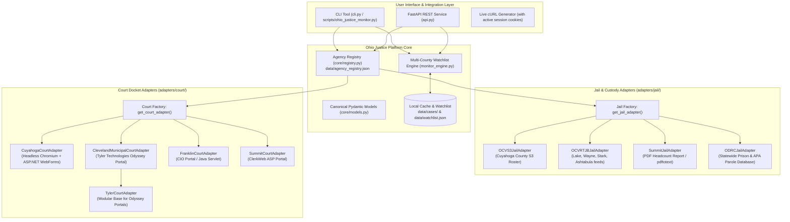

# Court Monitor (Multi-Jurisdiction Justice & Custody Platform)

A modular API, CLI toolkit, and background monitoring engine for tracking court dockets, case filings, and jail/prison custody status across multiple counties and states.

Originally developed to monitor Cuyahoga County case `CR-26-711470-A` (`THE STATE OF OHIO vs. CAITLIN O'BOYLE`), the platform has evolved into an extensible, multi-county architecture capable of indexing diverse court management and jail management software vendors.

---

## 1. System Architecture



---

## 2. Supported Ohio Jurisdictions & Capability Matrix

All 38 registered agencies are dynamically indexed in [`data/agency_registry.json`](file:///home/llmuser/projects/court-monitor/data/agency_registry.json):

| County ID | Agency / Jurisdiction | Court Docket | Jail Roster | Architecture / Vendor |
| :--- | :--- | :---: | :---: | :--- |
| **`cleveland_muni_oh`** | Cleveland Municipal Court | ✅ Active | N/A | Tyler Technologies Odyssey Portal (`CMCPORTAL`) + AWS WAF |
| **`cuyahoga_oh`** | Cuyahoga County Common Pleas & Sheriff | ✅ Active | ✅ Active | ASP.NET WebForms + OCV S3 JSON (`a26544113`) |
| **`lake_oh`** | Lake County Clerk of Courts & Sheriff | ✅ Active | ✅ Active | CourtView + OCV RTJB Mobile Feed |
| **`wayne_oh`** | Wayne County Sheriff's Office | Planned | ✅ Active | Henschen + OCV RTJB Mobile Feed |
| **`stark_oh`** | Stark County Sheriff's Office | Planned | ✅ Active | Custom Web + OCV RTJB Mobile Feed |
| **`ashtabula_oh`**| Ashtabula County Sheriff's Office | Planned | ✅ Active | CourtView + OCV RTJB Mobile Feed |
| **`summit_oh`** | Summit County Clerk & Sheriff (Akron) | ✅ Active | ✅ Active | Summit ClerkWeb ASP + Live PDF Headcount Stream |
| **`franklin_oh`** | Franklin County Clerk & Sheriff (Columbus)| ✅ Active | Planned | IBM WebSphere CIO + Sheriff Portal |
| **`hamilton_oh`** | Hamilton County Clerk & Justice Center | ✅ Active | Planned | CourtClerk Portal + Sheriff Inmate Portal |
| **`odrc_statewide`**| Ohio Dept of Rehabilitation & Correction | N/A | ✅ Active | Statewide Prison, Parole & Post-Release Control |
| **Regional Jails (30+)** | Auglaize, Trumbull, Jefferson, Crawford, etc. | Planned | ✅ Active | Automated OCV RTJB Feed Adapters (Aurora Harvested) |

> [!TIP]
> Complete technical documentation for expanding to other vendors and US states is maintained in [`docs/VENDOR_REGISTRY.md`](file:///home/llmuser/projects/court-monitor/docs/VENDOR_REGISTRY.md).

---

## 3. CLI Quickstart

Run commands via the master virtual environment (`/home/llmuser/.venv/bin/python`):

### List All Indexed Ohio Counties
```bash
python3 cli.py counties
```

### Statewide Custody Search (All Active Jails + State Prison System)
Simultaneously queries Cuyahoga Jail, Summit Jail, and the statewide ODRC prison/parole system in parallel:
```bash
python3 cli.py jail-statewide --name "Caitlin O'Boyle"
python3 cli.py jail-statewide --name "Abston"
```

### Single-County Jail Custody Check
```bash
# Check Cuyahoga County:
python3 cli.py jail-status --name "Caitlin O'Boyle" --county cuyahoga_oh

# Check Summit County (Akron):
python3 cli.py jail-status --name "Abston" --county summit_oh
```

### Search Court Dockets & Case Summaries
```bash
# Search by defendant name:
python3 cli.py search-name --last "O'Boyle" --first "Caitlin" --county cuyahoga_oh

# Inspect full case summary & criminal charges:
python3 cli.py summary --year 2026 --number 711470 --county cuyahoga_oh

# Fetch full chronological court docket:
python3 cli.py docket --year 2026 --number 711470 --county cuyahoga_oh
```

### Manage Multi-County Watchlist & Automated Diffing
```bash
# View current watchlist:
python3 cli.py watchlist

# Add a case to watchlist with county tag:
python3 cli.py watch-add --case CR-26-711470-A --county cuyahoga_oh --label "State vs. Caitlin O'Boyle"

# Run diff check across all watchlisted cases:
python3 cli.py monitor-check
```

### Generate Live cURL Command with Validated Cookies
```bash
python3 cli.py curl --url "https://cpdocket.cp.cuyahogacounty.gov/CR_CaseInformation_Docket.aspx?q=hRRTYX-BnjfUgnoAk-HSrQ00n6DjqAxFUzIxKeQ1ac41"
```

---

## 4. REST API Endpoints (`api.py`)

Launch the API server with:
```bash
python3 cli.py serve --port 8000
```
Interactive Swagger UI is accessible at `http://127.0.0.1:8000/docs`.

### Key Endpoints:
* `GET /api/counties` — List all registered Ohio counties, court adapters, and jail services.
* `GET /api/counties/{county_id}` — Inspect configuration for a specific county.
* `GET /api/jail/statewide/status?name={name}` — Fan-out query across all active Ohio jails + ODRC.
* `GET /api/jail/{county_id}/status?name={name}` — Custody lookup in a specific county.
* `GET /api/jail/{county_id}/roster?limit=50` — Inmate roster for a specific facility.
* `GET /api/court/{county_id}/search/name?last_name=X&first_name=Y` — Search court filings by name.
* `GET /api/court/{county_id}/docket/{case_number}` — Complete docket entries for a case.
* `GET /api/watchlist` — View all watched cases across counties.
* `POST /api/monitor/check` — Trigger a background diff check.
* `GET /api/curl?url={url}` — Generate valid curl command with active cookies.

---

## 5. Fleet Helper Mirroring

In compliance with RPDevs workspace standards, the primary tool is mirrored to the fleet helper collection:
* Canonical Project Location: [`cli.py`](file:///home/llmuser/projects/court-monitor/cli.py) & [`scripts/ohio_justice_monitor.py`](file:///home/llmuser/projects/court-monitor/scripts/ohio_justice_monitor.py)
* Mirrored Fleet Location: [`/home/llmuser/projects/.scripts/python/ohio_justice_monitor.py`](file:///home/llmuser/projects/.scripts/python/ohio_justice_monitor.py)
* Cataloged in: [`/home/llmuser/projects/.scripts/SCRIPTS.md`](file:///home/llmuser/projects/.scripts/SCRIPTS.md)
